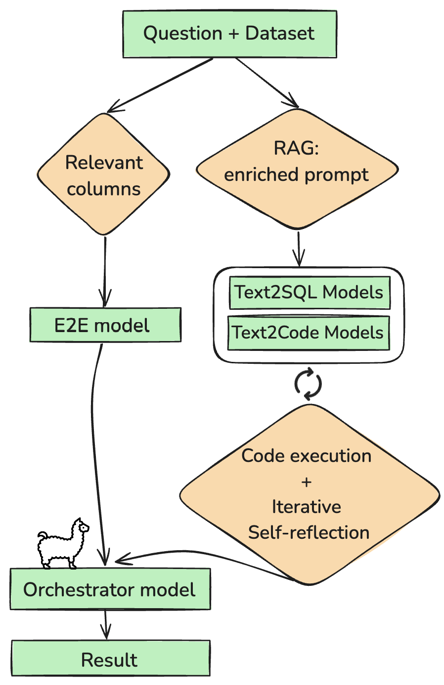

# Team Anotheroption's solution at SemEval-2025 Task 8: Bridging the Gap Between
Open-Source and Proprietary LLMs in Table QA

This repository contains the code and related materials for our submission to SemEval-2025 Task 8: Question Answering (QA) over tabular data. Our team, "Anotheroption," developed a hybrid system to address this challenging task using the DataBench benchmark.

## Project Overview

This project focuses on building a system capable of accurately answering natural language questions posed against data presented in tabular format.

*   **Text-to-Code Generation (Pandas):** Translating natural language questions into executable Pandas code.
*   **Self-Correction/Reflection:** Using LLM feedback on failed code attempts to generate corrected code.
*   **SQL Fallback:** Generating and executing SQL queries as an alternative if Python code generation fails.
*   **End-to-End (E2E) Answer Generation:** Directly generating answers from a textual representation of relevant table parts.
*   **LLM-Guided Voting:** An LLM selects the most probable solution from multiple successful candidate answers generated by the other components.

## Project Structure

```
.
├── .env                 # Store API keys (e.g., OPENROUTER_API_KEY)
├── config.json          # Configuration for the pipeline (optional, defaults in main.py)
├── data/                # Directory for local dataset caches (.parquet files)
├── logs/                # Directory for various log files (attempts, voting, etc.)
├── src/
│   ├── __init__.py
│   ├── clients/         # API clients (e.g., OpenAI/OpenRouter)
│   ├── data/            # Data loading and caching logic
│   ├── evaluation/      # Response evaluation logic against ground truth
│   ├── processing/      # Core pipeline stages (Python exec, SQL fallback, E2E, Voting)
│   └── utils/           # Utility functions (text cleaning, code cleaning, prompts, embeddings)
├── main.py              # Main script to run the pipeline
├── requirements.txt     # Python dependencies for the code
├── Pipeline_show_version.ipynb # Original notebook implementation
├── solution_scheme.png  # Image file for the solution scheme
└── README.md            # This file
```

## Setup

## Installation

1.  **Clone the repository:**

    ```bash
    git clone https://github.com/Nickolas-option/QA_on_Tabular_Data_SemEval2025_Task8
    cd QA_on_Tabular_Data_SemEval2025_Task8
    ```

2.  **Create a virtual environment:**
    ```bash
    python -m venv venv
    source venv/bin/activate  # On Windows use `venv\Scripts\activate`
    ```

3.  **Install Dependencies:**
    ```bash
    pip install -r requirements.txt
    ```
    *Note: Depending on your system, you might need to install PyTorch separately following instructions on the [PyTorch website](https://pytorch.org/) to ensure GPU/MPS support if available.*

4.  **Configure API Key:**
    Create a `.env` file in the project root directory and add your OpenRouter API key:
    ```dotenv
    OPENROUTER_API_KEY="your_openrouter_api_key"
    # Optionally add OPENROUTER_API_KEY2 as a fallback
    # OPENROUTER_API_KEY2="your_fallback_key"
    # Optionally override the base URL if needed
    # OPENROUTER_BASE_URL="your_custom_api_base_url"
    ```

## Running the Pipeline

The main script `main.py` orchestrates the process defined in the notebook.

**Basic Usage:**

```bash
python main.py
```

This will run the pipeline with default settings (using the `semeval/dev` dataset, processing all questions one by one, saving results to `solution_results.txt`, and logs to the `logs/` directory). It will attempt to resume from the last processed question based on the results file.

**Configuration:**

You can customize the run using command-line arguments or a `config.json` file.

*   **Command-line Arguments:**
    *   `--config <path>`: Specify a path to a JSON configuration file (default: `config.json`).
    *   `--start_index <int>`: Force start processing from a specific question index (overrides resume logic).
    *   `--max_questions <int>`: Process a maximum number of questions from the starting point.
    *   `--is_sample`: Use the smaller 'sample' tables instead of the full 'all' tables for faster testing/debugging.
    *   `--batch_size <int>`: Process questions in batches (default: 1).

    *Example:* Process the first 10 questions using sample data:
    ```bash
    python main.py --max_questions 10 --is_sample
    ```

*   **JSON Configuration (`config.json`):**
    Create a `config.json` file in the root directory to override defaults. This allows for more detailed configuration of the pipeline stages. Example:
    ```json
    {
      "data_dir": "./data",
      "log_dir": "./logs",
      "results_file": "solution_results.txt",
      "results_log_file": "solution_results_logs.txt",
      "dataset_name": "semeval",
      "dataset_split": "dev",
      "is_sample": false,
      "start_index": null, // Set to integer to force start, null to resume
      "max_questions": null, // Set to integer to limit processing, null for all
      "batch_size": 1,
      "stop_on_error": true, // Stop if a fatal error occurs during question processing
      "pipeline_config": {
        "n_python_attempts": 1, // How many different models to try for Python code gen
        "enable_reflection": true, // If Python fails, try reflecting on errors
        "enable_sql_fallback": true, // If Python (+ reflection) fails, try SQL
        "n_sql_attempts": 1, // How many attempts for SQL generation
        "enable_e2e": true // Include the direct E2E answering method
      }
    }
    ```

## How the Pipeline Works

1.  **Data Loading:** Loads the specified dataset (`semeval/dev` by default) using Hugging Face `datasets`, caching locally in the `data/` directory (`src/data/loader.py`).
2.  **Initialization:** Sets up the OpenAI client configured for OpenRouter using credentials from `.env` (`src/clients/openai_client.py`).
3.  **Processing Loop (`main.py`):** Iterates through the dataset questions (handling resuming, batching, and limits).
4.  **Core Pipeline (`src/processing/pipeline.py`):** For each question, it orchestrates the following steps based on the configuration:

    a.  **Python Generation:** Attempts to generate Python (Pandas) code using LLMs (`get_python_solutions`). Executes the code safely with a timeout (`src/processing/python_execution.py`).

     b.  **Reflection (Optional):** If initial Python attempts fail, it can use LLM reflection on the errors to generate new Python code (`handle_failed_solutions`).

    c.  **SQL Fallback (Optional):** If Python approaches fail, it generates SQL queries using an LLM, loads the relevant data into an in-memory SQLite database, and executes the SQL (`src/processing/sql_execution.py`).

     d.  **E2E Answering (Optional):** Converts relevant parts of the table to text (markdown) and asks an LLM to answer the question directly based on the text (`src/processing/e2e.py`).

    e.  **Voting:** Gathers all successful results from the enabled stages and uses an LLM to vote for the most likely correct answer (`src/processing/voting.py`).
6.  **Evaluation (`src/evaluation/evaluate.py`):** Compares the final voted answers against the ground truth in the dataset and calculates accuracy.
7.  **Logging:** Saves the final results (`solution_results.txt`), evaluation logs (`solution_results_logs.txt`), and detailed attempt/solution logs (in the `logs/` directory).

## Original Notebook

The original implementation and experimentation environment can be found in `Pipeline_show_version.ipynb`. It requires the same dependencies and API key setup.

## Data

*   The primary dataset used is DataBench (`cardiffnlp/databench` on Hugging Face).
*   The code (both notebook and `main.py`) downloads the needed data automatically and caches it in the `data/` directory.

## Competition Results

*   We ranked in the top 13 out of 38 teams in the competition's OpenSource-models-only section, achieving an accuracy score of 80 on the Databench evaluation.
*   In the global ranking, which includes proprietary models, we placed in the top 20 out of 53 teams while exclusively using open-source models.

## Solution Scheme
*(As implemented in the pipeline)*



